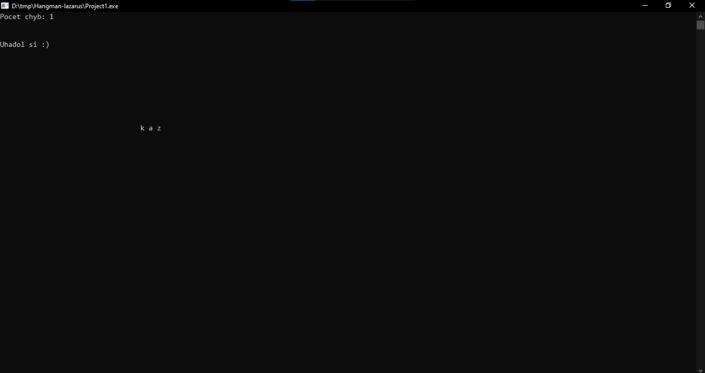

# Hangman Game in Pascal

## Overview

This Pascal program implements a simple Hangman game where the player needs to guess a word by suggesting letters. The game randomly selects a word from a predefined list, and the player has a limited number of attempts to guess the word. The objective is to reveal the hidden word by correctly guessing its letters.

## Features

-   **Word Selection:** The game randomly selects a word from a list.
-   **Word Masking:** The selected word is initially masked, and the player uncovers it by guessing individual letters.
-   **Input Handling:** Accepts lowercase letters as input for guessing.
-   **Visual Feedback:** Displays the partially revealed word and the number of incorrect guesses.
-   **Game Outcome:** Declares victory if the player correctly guesses the word or defeat if the maximum number of incorrect attempts is reached.

## Controls

-   **Letter Keys (a-z):** Enter letters to guess the hidden word.

## Getting Started

1. Copy the program code into your Pascal environment.
2. Ensure that the Pascal environment supports the `crt` unit.
3. Create a file named `slova.txt` containing a list of words (one word per line).

## Gameplay Instructions

-   The game will randomly select a word from the list.
-   The masked word will be displayed with underscores, representing unknown letters.
-   Enter lowercase letters to guess the hidden word.
-   The game will reveal correctly guessed letters in the word.
-   The number of incorrect guesses is displayed.
-   The game ends when the word is fully revealed or the maximum incorrect attempts are reached.

## Screenshots

## Word List (slova.txt)

Create a file named `slova.txt` and add a list of words, with one word per line. These words will be used by the game.

## License

This project is licensed under the MIT License - see the [LICENSE](LICENSE) file for details.
